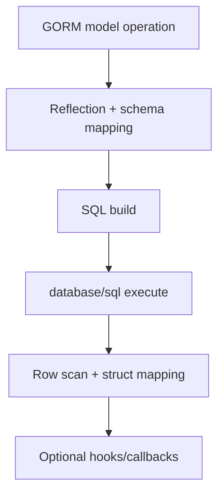
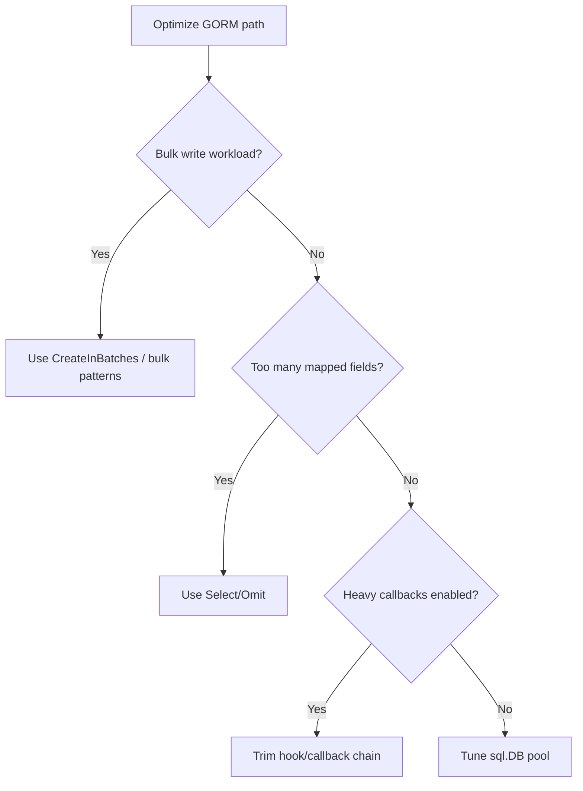

# Performance Guide

This document describes performance behavior for `gorm-cubrid` and practical tuning guidance.

## Overview

`gorm-cubrid` is a GORM dialect that runs on top of the `cubrid-go` driver.

## Benchmark Results

Source: [cubrid-benchmark](https://github.com/cubrid-labs/cubrid-benchmark)

Environment: Intel Core i5-9400F @ 2.90GHz, 6 cores, Linux x86_64, Docker containers.

Driver baseline workload: Go `cubrid-go` vs `go-sql-driver/mysql`, 1000 rows x 5 rounds.

Observed outcome: near parity (approximately 1:1 ratio).

Note: GORM adds ORM-layer overhead, mainly reflection and model mapping cost.

## Performance Characteristics

- Baseline driver parity is strong; ORM overhead determines most extra latency in app paths.
- Reflection-based model metadata and change tracking add CPU work for each operation.
- Callback/hook chains can add measurable per-row overhead in high-throughput flows.
- Bulk operations dramatically reduce ORM overhead per row.

## Optimization Tips

- Prefer batch operations (`CreateInBatches`, bulk updates) for write-heavy workloads.
- Use selective fields (`Select`, `Omit`) to reduce model mapping work.
- Minimize hooks on hot paths or move logic to set-based SQL when possible.
- Tune `database/sql` pool settings under GORM's underlying `sql.DB`.

## Running Benchmarks

1. Clone `https://github.com/cubrid-labs/cubrid-benchmark`.
2. Launch benchmark Docker databases (CUBRID and MySQL).
3. Run Go driver baseline benchmarks for parity reference.
4. Run equivalent GORM workloads using matching row counts and rounds.
5. Compare baseline vs ORM-layer timings to identify reflection/mapping overhead.

See benchmark repo docs for exact scripts and command options.
