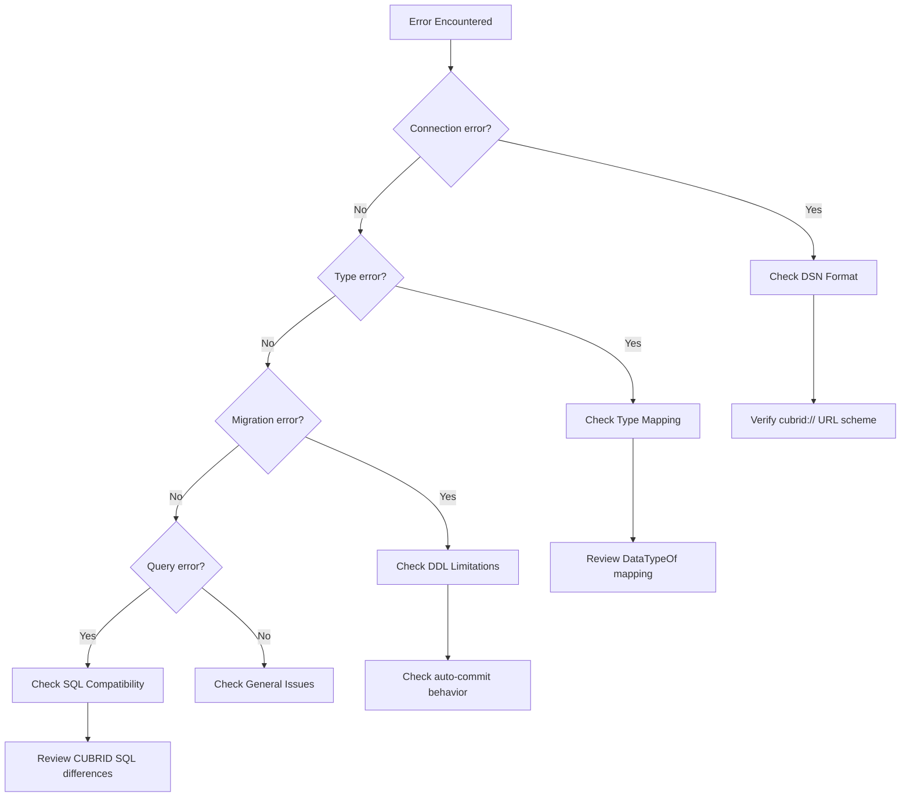

# Troubleshooting

Common issues and solutions for the GORM CUBRID dialect.

## Diagnostic Flow



## Connection Issues

### Error: `failed to open database connection`

**Cause**: Invalid DSN format or unreachable database server.

**Solution**:
1. Verify the DSN uses `cubrid://` URL scheme (not `cci:CUBRID:`):
   ```go
   // ✅ Correct
   cubrid.Open("cubrid://dba@localhost:33000/demodb")

   // ❌ Wrong — old format, no longer supported
   cubrid.Open("cci:CUBRID:localhost:33000:demodb:::")
   ```
2. Ensure the CUBRID database is running and accessible on the specified host/port.
3. Check firewall rules for port `33000` (default CUBRID broker port).

### Error: `failed to ping database`

**Cause**: Connection opened successfully but the database didn't respond to ping.

**Solution**:
- Check if the CUBRID broker is running (`cubrid broker status`).
- If using Docker, wait for the container to be fully initialized:
  ```bash
  docker compose up -d
  sleep 10  # CUBRID needs time to initialize
  ```
- For test/lazy connections, use `SkipPing: true`:
  ```go
  cubrid.New(cubrid.Config{DSN: dsn, SkipPing: true})
  ```

### Error: `driver "cubrid" not registered`

**Cause**: Missing cubrid-go driver import.

**Solution**: Add a blank import for the driver:
```go
import _ "github.com/cubrid-labs/cubrid-go"
```

## Type Mapping Issues

### Boolean fields stored as 0/1

**Expected behavior**: CUBRID has no native `BOOLEAN` type. GORM maps `bool` fields to `TINYINT(1)`. Values are stored as `0` (false) and `1` (true).

### Large strings truncated

**Cause**: Default `VARCHAR` size is 256 characters.

**Solution**: Set a larger default or use field tags:
```go
// Option 1: Increase default size globally
cubrid.New(cubrid.Config{DSN: dsn, DefaultStringSize: 4096})

// Option 2: Use field tags
type Article struct {
    Content string `gorm:"type:clob"`       // Use CLOB for very large text
    Summary string `gorm:"type:varchar(2000)"` // Explicit size
}
```

### No unsigned integers

CUBRID does not support `UNSIGNED` integer types. All `uint` fields in Go models are mapped to their signed equivalents (`TINYINT`, `SMALLINT`, `INT`, `BIGINT`). This is safe for most use cases but be aware of the range difference for `uint64` values near `math.MaxInt64`.

## Migration Issues

### DDL auto-commits

CUBRID auto-commits DDL statements. This means `AutoMigrate` changes cannot be rolled back within a transaction:
```go
// ⚠️ Transaction wrapping has no effect on DDL
tx := db.Begin()
tx.AutoMigrate(&User{})  // This auto-commits immediately
tx.Rollback()             // Won't undo the migration
```

### `AutoMigrate` creates indexes after table

This is by design. CUBRID requires indexes to be created in separate statements after `CREATE TABLE`, matching the dialect's `CreateIndexAfterCreateTable: true` setting.

## Query Issues

### No `RETURNING` clause

CUBRID does not support `INSERT ... RETURNING` or `UPDATE ... RETURNING`. GORM's `Create` method issues a separate `SELECT` to retrieve auto-generated values.

### Identifier quoting

CUBRID uses backtick (`` ` ``) quoting for identifiers, similar to MySQL. The dialect handles this automatically. If you use raw SQL, quote identifiers manually:
```go
db.Raw("SELECT `name`, `age` FROM `users` WHERE `id` = ?", 1)
```

### Placeholder style

CUBRID uses `?` positional placeholders (MySQL-style), not `$1` (PostgreSQL-style). The dialect handles this automatically for all GORM operations.

## Docker Issues

### Container takes long to start

CUBRID needs 10-15 seconds to fully initialize. Use health checks:
```yaml
services:
  cubrid:
    image: cubrid/cubrid:11.2
    ports:
      - "33000:33000"
    healthcheck:
      test: ["CMD", "bash", "-c", "echo > /dev/tcp/127.0.0.1/33000"]
      interval: 10s
      timeout: 5s
      retries: 12
```

## Getting Help

1. Check the [README](../README.md) for basic usage
2. Review [API Reference](API_REFERENCE.md) for all available options
3. Open an issue on [GitHub](https://github.com/cubrid-labs/gorm-cubrid/issues)
